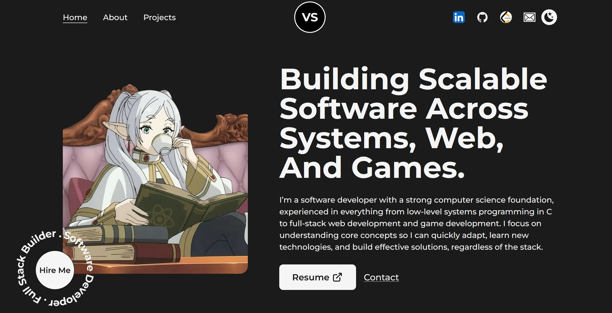

# 💻 Vaibhav Saini - Portfolio Website

A modern, responsive developer portfolio built with Next.js and Tailwind CSS, showcasing my projects, skills, and experience in systems programming, web development, and game development.

## 🚀 Live Demo
[View Portfolio](https://vsaini-portfolio.vercel.app/)

## 🛠️ Tech Stack
- Next.js
- React
- Tailwind CSS
- Framer Motion

## ✨ Features
- Fully responsive design across all devices
- Smooth animations using Framer Motion
- Dark/Light mode toggle
- Interactive UI components
- Project showcase with detailed descriptions
- Custom theming and styling

## 📸 Preview


## 🧠 What I Learned
- Improved understanding of responsive design (Tailwind breakpoints, layouts)
- Handling animation with Framer Motion
- Debugging and adapting outdated code (such as moving from Tailwind V3 to Tailwind V4)
- Structuring scalable frontend components

## ⚙️ Getting Started

Clone the repository:

```bash
git clone https://github.com/vaibhav-saini-dev/portfolio.git
cd portfolio

npm install

npm run dev
```
## 📜 Credits
This repository is based off the starter code https://github.com/codebucks27/Next.js-Developer-Portfolio-Starter-Code made by codebucks27 <br />

### Resources Used in This Project
- Fonts from https://fonts.google.com/ <br />
- Icons from https://iconify.design/ <br />

### External Libraries used in this project:

- [framer-motion](https://www.framer.com/motion/) <br />
- [Tailwind css](https://tailwindcss.com/) <br />
